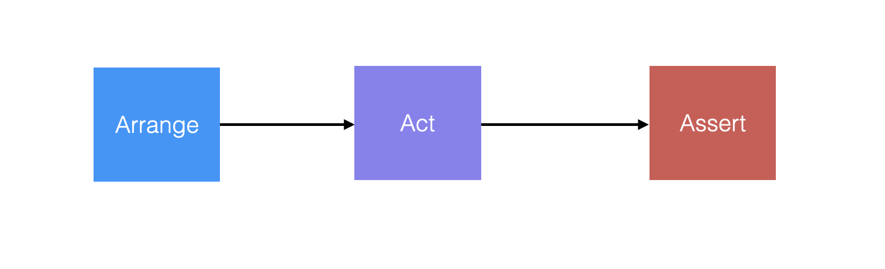
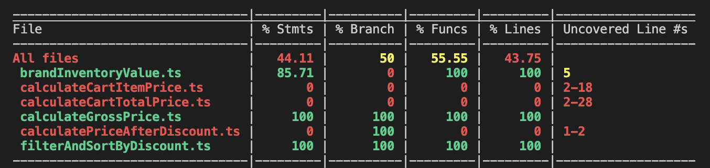
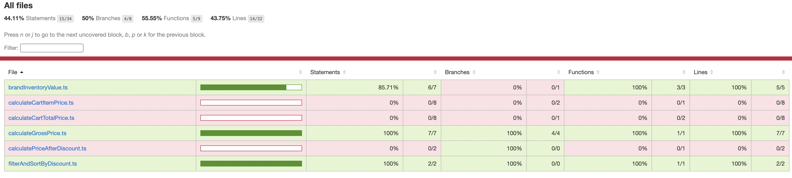
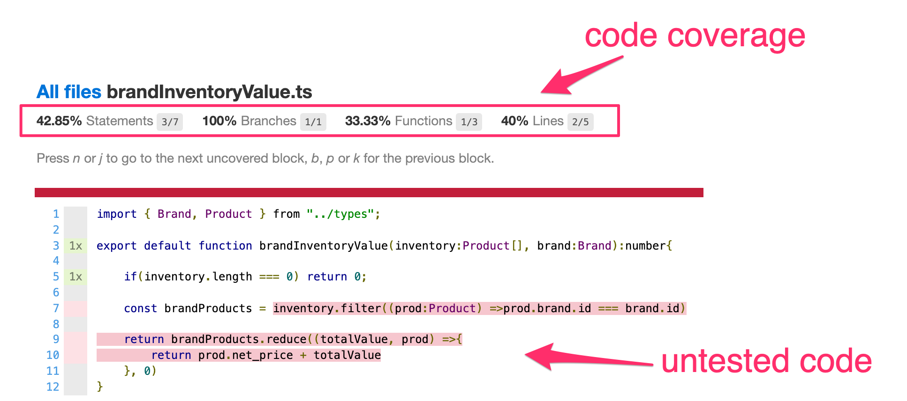
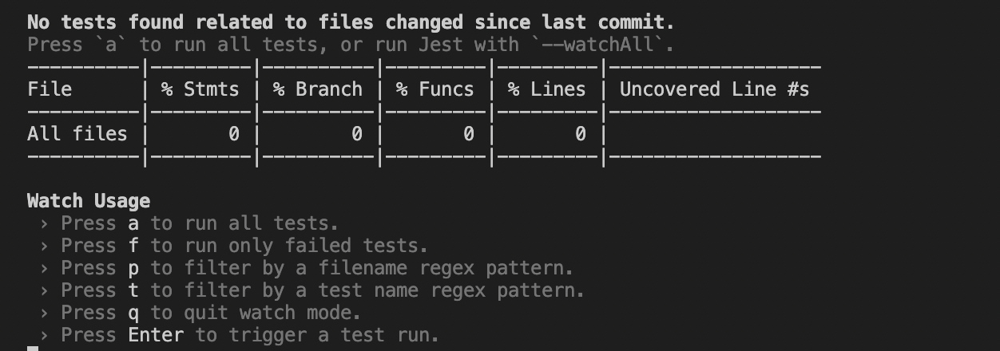
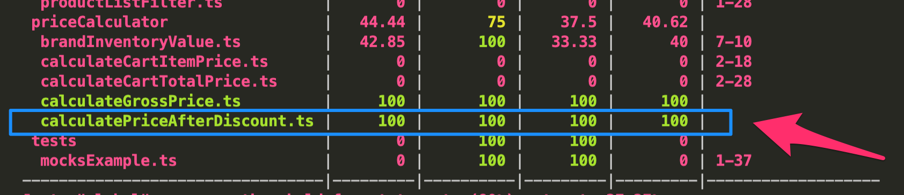
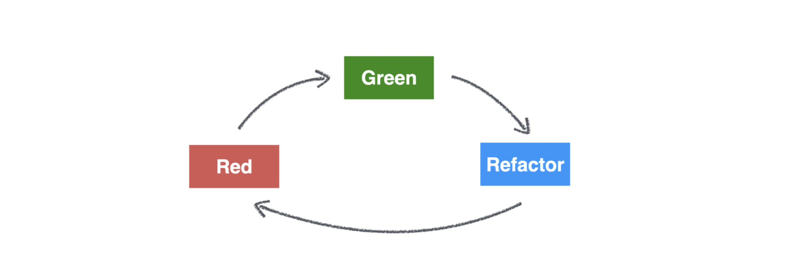
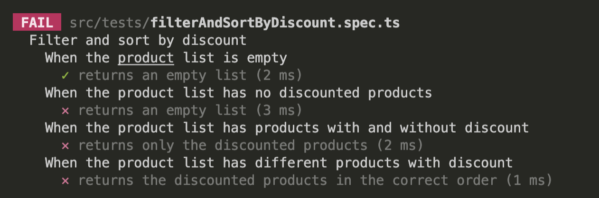

# Action Item: The `AAA` Pattern 🔬
In this **Action Item**, you will:
- :gear: write effective `tests` following the `AAA` pattern
- 🕵️ learn how to use `code coverage` to measure your testing progress
- :vertical_traffic_light: get introduced to `Test-Driven Development` 

------

## Challenges:
1. 💪[**COMPETENT**] Write a simple `unit` test using the `AAA` pattern
2. 🏋🏽‍♀️[**PROFICIENT**] Add the missing function, in a `TDD` style
3. 🔥[**PROFICIENT**] Write an `integration test` 
4. 🧙‍♀️[**EXPERT**][**BONUS🎁**] Get the code coverage to `100%` using `automocking`

------

**HINT: Use the AAA pattern to structure your tests**


------

### :notebook_with_decorative_cover: Tips for effective test writing:

1. **Test the public Interface/APIs** of the system rather than the internal functions.
2. **Test state, not interactions.** Rather than testing how the system got to a certain result, test the result.
3. **Test Behaviors, not Functions.** Do not try to match the structure of the test to the one of the code.
4. It is ok to repeat yourself(forget **DRY**) and be **DAMP**(Descriptive and Meaningfully Phrases)
5. Write Clear Error Messages:  **Given -> When -> Then**

------

<details closed>
<summary>WALK-THROUGH: 1.[COMPETENT] Write a simple unit test </summary>
<br>

Test a single function in isolation using a `unit test`.

##### 1.1 Install dependencies:
```bash
npm install
```
##### 1.2 Run the tests:
```bash
npm test
```
Check the terminal and inspect the results.
##### 1.3 :mag: Inspect the code coverage
The tests will now run when you change your code. You should also see the current **Code Coverage**:

#####  Check the coverage folder and open the [coverage/lcov-report/index.html](coverage/lcov-report/index.html) file in your browser. You should see something like this:



Code Coverage for a specific function:


##### 1.3 Complete the missing tests:

- 📝 Add tests for [calculatePriceAfterDiscount.ts](src/priceCalculator/calculatePriceAfterDiscount.ts) and get the coverage to 100% for this function  


Follow the examples in the tests files:

- [calculateGrossPrice.spec.ts](src/tests/calculateGrossPrice.spec.ts)
- [brandInventoryValue.spec.ts](src/tests/brandInventoryValue.spec.ts)


Run the tests in `watch` mode:
```bash
npm run test:dev
```
You should see something like this:


Press **a** to run all the tests. Keep them running to get real-time feedback on your progress.

Make sure you cover the function at 100% in tests, see below:



##### Solution:
- **🚀 CODE SOLUTION - Adding a unit test: `git checkout solution_one`**
- **🖥️ [VIDEO SOLUTION - Adding a unit test](https://www.loom.com/share/a9473ebad1684a089a9d3245491658e1)**

</details>

------

<details closed>
<summary>WALK-THROUGH: 2.[PROFICIENT] Add the missing function, in a TDD style</summary>
<br>

Use `Test-Driven Development` to implement a method. We have already written test cases for the function, you have to write the code.

##### TODO's:
- 📝 Complete the function in [filterAndSortByDiscount.ts](src/filterFunctions/filterAndSortByDiscount.ts/) so the test in [filterAndSortByDiscount.spec.ts](src/tests/filterAndSortByDiscount.spec.ts) will pass.



Check the failed test message and implement a function to make the tests pass:



##### Solution:
- **🚀 CODE SOLUTION - Add the function in TDD style: `git checkout solution_two`**
- **🖥️ [VIDEO SOLUTION - Add the function in TDD style](https://www.loom.com/share/576e222869334cc6b3bcc6809bebe218)**

</details>

------

<details closed>
<summary>WALK-THROUGH: 3.[PROFICIENT] Write an integration test </summary>
<br>

##### TODO's:
- 📝 Add tests for [calculateCartItemPrice.ts](src/priceCalculator/calculateCartItemPrice.ts) and get the coverage to 100% for this function


💡 HINT: Use `jest` to [mock dependencies](https://jestjs.io/docs/mock-functions).

Note: We have added some `mock` objects to make it easier for you in [mocksExample.ts](src/tests/mocksExample.ts).


##### Solution:
- **🚀 CODE SOLUTION - Add integration tests: `git checkout solution_three`**
- **🖥️ [VIDEO SOLUTION - Add integration tests](https://www.loom.com/share/ee93af8725154a6292d74839693baabb)**
#### 3.1 `EXPERT` - Use `auto-mocking` for your test objects

💡 HINT: Use `ts-auto-mock` to [easily create mock objects](https://typescript-tdd.github.io/ts-auto-mock/create-mock).

```typescript
    const discountedProduct = createMock<Product>({
        discount: {
            isEnabled: true,
            percentage: 50,
        },
    });
```

##### Solution:
- **🚀 CODE SOLUTION - Set up auto-mocks: `git checkout solution_three_automocks`**
- **🖥️ [VIDEO SOLUTION - Set up auto-mocks](https://www.loom.com/share/391423b06c3c4b5f93a819b2a3e6035b)**


</details>

------

<details closed>
<summary>WALK-THROUGH: 4.[EXPERT][BONUS🎁] Get the code coverage to 100% by addding integration tests</summary>
<br>

##### TODO's:
- 📝 Get the code coverage to **`100%`** for the module by adding `integration` tests in [priceCalculator.spec.ts](src/tests/priceCalculator.spec.ts)

💡 HINT: Use `jest` to [mock dependencies](https://jestjs.io/docs/mock-functions).

💡 HINT: Use `ts-auto-mock` to [easily create mock objects](https://typescript-tdd.github.io/ts-auto-mock/create-mock).


</details>


### Getting Help 
If you have issues with the Action Item, you can get help and feedback in the [Community](https://community.theseniordev.com/) or, in the [Weekly Calls](https://calendar.google.com/calendar/u/0?cid=Y19kbGVoajU1Z2prNXZmYmdoYmxtdDRvN3JyNEBncm91cC5jYWxlbmRhci5nb29nbGUuY29t).

### Made with :orange_heart: in Berlin by @TheSeniorDev
Ricardo Kreyhsig
